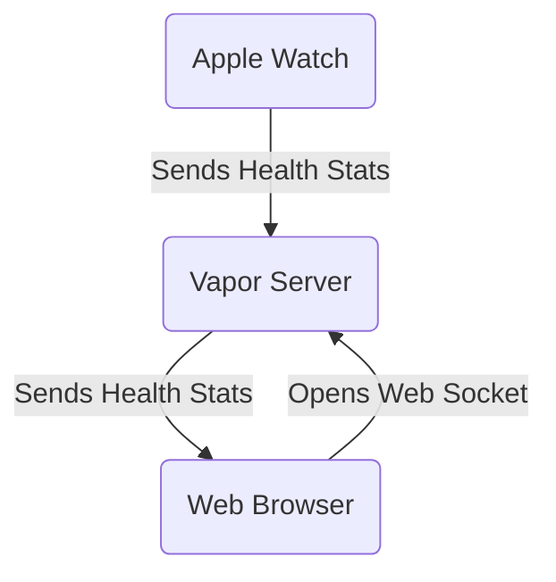

# The gBeat Ecosystem

## How the applications work

   2. Integration with Apple Watch
   3. User experience highlights

### Participant 
1. User Signs in with Apple
2. User Enters Code for Workout Class
3. User Starts Workout

### Instructor
1. Instructor Signs In With Apple
2. Instructor Creates a Workout Class with an optional schedule.
3. Instructor Starts the Class
4. Instructor Shares Web Browser in Streaming Platform
5. Instructors Shares Workout Class Code
6. Class Begins!

## Integration with Apple Watch

1. Restricts User Interface to Simplest Possible
2. (Independent without iPhone App) Reduces exposure to App Store
3. Developer Challenges
4. Wish there was another way without the code.

## User experience highlights

1. Simple Authentication Experience on Apple Watch.
2. Quick ...
