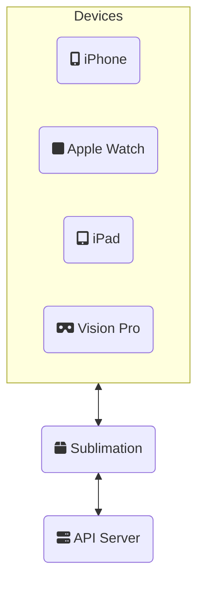

# Development Server Auto-discovery 

Besides dealing with challenges of Apple Watch development, we needed a solution for reaching the development server we are working on.

## The challenge of discovering local development servers in full stack development

When you are developing a full stack Swift application, you want to easily test and debug your application on both the device (iPhone, Apple Watch, iPad, etc...) as well as your development server. If you are using simulator then setting your host server to `localhost` will work but often we need to test on an actual device. 

## Specific issues with Apple Watch development

This is especially true when it comes to developing on for the Apple Watch. There's no easy input control for the developer change the server address.

## Introduction to Sublimation: A Swift package solution

So I ended up creating a Swift Package to enable automatic discovery of your local development server on the fly called Sublimation. It turns your Vapor server from a mysterious gas to a tangible solid server to connect to.

### Overview of Sublimation's purpose and functionality

The purpose is to optimize developer experience and remove as much need to be an IT expert or tinking with the development environment.

### Server and Client components

For the server and client we need a way to communicate that information without the client knowing where the server is initially. 

    
There's two ways to do this - have a consistent location for fetching the address or a way to discover the service on the network.

## Ngrok integration (initial approach)

The initial approach was using `ngrok` to create an a public host name and entering that info in the app's environment variables `insert picture`. This worked but required the developer to update the environment each time _ngrok_ was restarted. If there was a way to save and fetch the new host name consistently for the developer that would reduce one more step.

### Using Ngrok for public exposure of development servers

### How Sublimation automates the Ngrok process

### Cloud setup for meta-server access (using kvdb.io)

### Limitations and challenges encountered

## Bonjour implementation (ultimate solution)

### How Sublimation uses Bonjour for local network discovery

### Benefits of the Bonjour approach over Ngrok

### Implementation details and code examples

### How it solved auto-discovery challenges in gBeat

## Impact on gBeat development

### Performance and developer experience improvements

### Seamless testing across iOS and watchOS devices