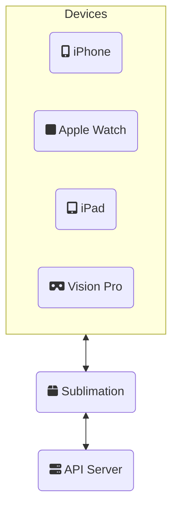
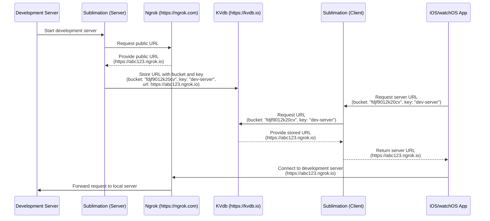

# Development Server Auto-discovery 

Besides dealing with challenges of Apple Watch development, we needed a solution for reaching the development server we are working on.

## The challenge of discovering local development servers in full stack development

When you are developing a full stack Swift application, you want to easily test and debug your application on both the device (iPhone, Apple Watch, iPad, etc...) as well as your development server. If you are using simulator then setting your host server to `localhost` will work but often we need to test on an actual device. 

## Specific issues with Apple Watch development

This is especially true when it comes to developing on for the Apple Watch. There's no easy input control for the developer change the server address.

## Introduction to Sublimation: A Swift package solution

So I ended up creating a Swift Package to enable automatic discovery of your local development server on the fly called Sublimation. It turns your Vapor server from a mysterious gas to a tangible solid server to connect to.

### Overview of Sublimation's purpose and functionality

The purpose is to optimize developer experience and remove as much need to be an IT expert or tinking with the development environment.

### Server and Client components

For the server and client we need a way to communicate that information without the client knowing where the server is initially. 




    
There's two ways to do this - have a consistent location for fetching the address or a way to discover the service on the network.

## Ngrok integration (initial approach)

The initial approach was using `ngrok` to create an a public host name and entering that info in the app's environment variables `insert picture`. This worked but required the developer to update the environment each time _ngrok_ was restarted. If there was a way to save and fetch the new host name consistently for the developer that would reduce one more step.

### Using Ngrok for public exposure of development servers

The missing piece was get the ngrok url created and storing in the cloud somehow via a fairly simple method. 

### How Sublimation automates the Ngrok process





What I found was that we can run `ngrok` on startup and access the newly created url via the local API. To store it in the cloud I found a service called kvdb.io which only required a bucket name and key for storing the public url.

#### Cloud setup for meta-server access (using kvdb.io)

If you haven't already setup an account with ngrok and install the command-line tool via homebrew. Next let's setup a key-value storage with kvdb.io which is currently supported. _If you have another service, please create an issue in the repo. Your feedback is helpful._ 

Sign up at kvdb.io and get a bucket name you'll use. You'll be using that for your setup. Essentially there are three components you'll need:

* **ngrok executable path**
    - if you installed via homebrew it's `/opt/homebrew/bin/ngrok` but you can find out using: `which ngrok` after installation
* **bucket name** from your kvdb.io 
* **key** from your kvdb.io 
    - you just need to pick something unique for your server and client to use
    
Save these somewhere in your shared configuration for both your server and client to access, such as an `enum`:

```swift
public enum SublimationConfiguration {
  public static let bucketName = "fdjf9012k20cv"
  public static let key = "my-"
}
```


#### Server Setup

When creating your `Sublimation` object you'll want to use the provided convience initializers ``SublimationTunnel/TunnelSublimatory/init(ngrokPath:bucketName:key:application:isConnectionRefused:ngrokClient:)`` to make it easier for **ngrok** integration with the ``SublimationTunnel/TunnelSublimatory``:

```swift
let tunnelSublimatory = TunnelSublimatory(
  ngrokPath: "/opt/homebrew/bin/ngrok", //
  bucketName: SublimationConfiguration.bucketName, // "fdjf9012k20cv"
  key: SublimationConfiguration.key, // "dev-server"
  application: { myVaporApplication }, // pass your Vapor.Application here
  isConnectionRefused: {$.isConnectionRefused}, // supplied by `SublimationVapor`
  transport: AsyncHTTPClientTransport() // ClientTransport for Vapor
)

let sublimation = Sublimation(sublimatory: tunnelSublimatory)
```

#### Client Setup

For the client, you'll need to import the ``SublimationKVdb`` module and retrieve the url via:

```swift
let hostURL = try await KVdb.url(withKey: key, atBucket: bucketName) 
```

### Limitations and challenges encountered

- difficult setup with installing ngrok and setting up configuration for each developer
- ngrok maybe already running?

## Bonjour implementation (ultimate solution)

### How Sublimation uses Bonjour for local network discovery

### Benefits of the Bonjour approach over Ngrok

### Implementation details and code examples

### How it solved auto-discovery challenges in gBeat

## Impact on gBeat development

### Performance and developer experience improvements

### Seamless testing across iOS and watchOS devices