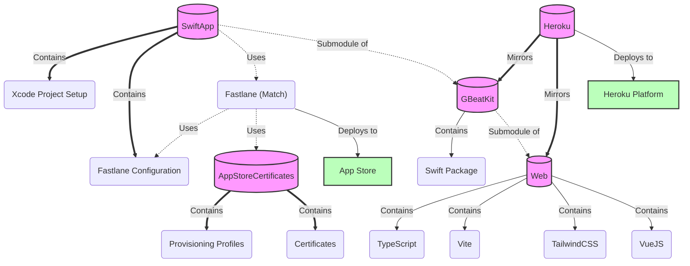
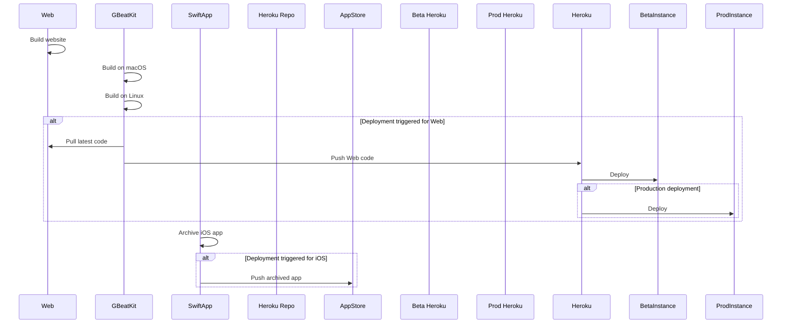
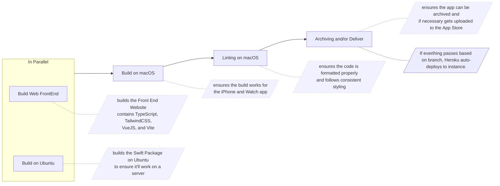

# Deployment and CI/CD

## Setting up Continuous Integration with GitLab

AppCertificates
Heroku
Web
Swift Package
App 

App -> run fastlane
  contains SPM
    contains Web
    
Heroku mirrors SPM with Web

Poly Repo
Submodules
Fastlane

## Setting up Continuous Integration with GitHub

## Deploying to Heroku

### Setting up Build Packs

### 
    1. Build Packs
      1. Vapor
      2. JS